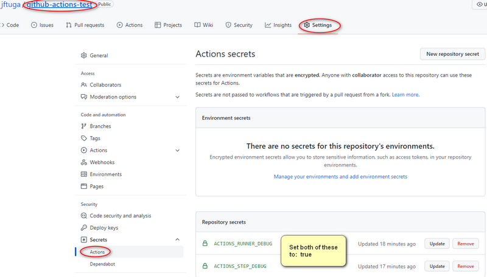
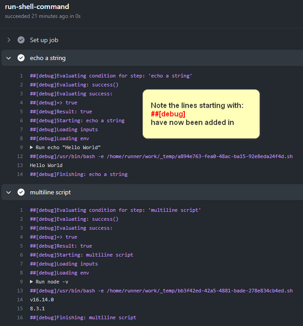
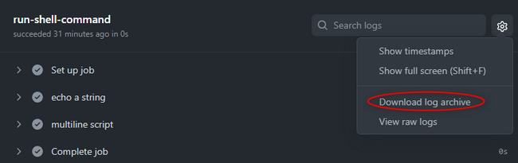

# Github Actions Notes
My personal notes about Github Actions

## Run
* Under Linux, the run command does not need to start with `#!/bin/bash` as this is implied.
* By default, `run` beings with `/usr/bin/bash -e {0}`.
* * The `-e` is similar to `set -e` - meaning the script will abort when any commands return a non-zero exit code.
* * `{0}` refers to an auto-generated shell script such as:
* * *  `/home/runner/work/_temp/a894e763-fea0-48ac-ba15-92e8eda24f4d.sh`
* * * The contents of the `run` script have been saved to this file by Github Actions.

## Debug
* [If the workflow logs do not provide enough detail to diagnose why a workflow, job, or step is not working as expected, you can enable additional debug logging.](https://docs.github.com/en/actions/monitoring-and-troubleshooting-workflows/enabling-debug-logging)

* You can download the `log archive`:
* * If you have `ACTIONS_RUNNER_DEBUG` and `ACTIONS_STEP_DEBUG` set to `true`, then your downloaded `log.zip` file will contain an additional folder: `runner-diagnostic-logs`

