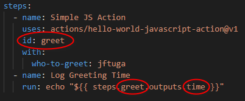

# Github Actions Notes
My personal notes about Github Actions

## Run
* Under Linux, the run command does not need to start with `#!/bin/bash` as this is implied.
* By default, `run` beings with `/usr/bin/bash -e {0}`.
* * The `-e` is similar to `set -e` - meaning the script will abort when any commands return a non-zero exit code.
* * `{0}` refers to an auto-generated shell script such as:
* * *  `/home/runner/work/_temp/a894e763-fea0-48ac-ba15-92e8eda24f4d.sh`
* * * The contents of the `run` command have been saved to this file by Github Actions.

## Action Shell
* A [list of all Github Action shells](https://docs.github.com/en/actions/using-workflows/workflow-syntax-for-github-actions#jobsjob_idstepsshell), including supported platforms

* You can use a different shell for the `run` command:

```yaml
      - name: python command
        run: |
          import platform
          print(platform.processor())
        shell: python
```

* You can use both `powershell` and `bash` under Windows:

```yaml
  run-windows-commands:
    runs-on: windows-latest
    steps:
      - name: Directory PowerShell
        run: Get-Location
      - name: Directory Bash
        run: pwd
        shell: bash
```

## Job Dependencies

* Jobs will run in parallel by default.
* By using `needs` in a step, you can make it depend on a previous step, thus making Github Actions run in serial instead of parallel


## Uses
`uses:` is used to run a third-party Github Action.

**Examples:**

* `actions/hello-world-javascript-action@v1`
* `actions/hello-world-javascript-action@master`
* `actions/hello-world-javascript-action@3ee2a0320c9193ab716b86a9dae253f5c16bae62`
* * After the `@` symbol, a `branch name`, `tag` or `commit` must be referenced.

The `with:` keyword provides an input to a `uses` actions:


* Note that `uses:` references a Github project: https://github.com/actions/hello-world-javascript-action

`Outputs` can also be obtained by giving your `with` input an `id:` and then referencing it with a GitHub Action generated macro:

* `${{ steps.id_name.outputs.output_name }}`
* * `id_name` is defined in the input step by using `id:`
* * `output_name` is a predefined output from the included Github Action itself
* * * This name will be found in the documentation of the imported action



## Checkout Action

By default, Github Actions does not clone your repository into the Github Actions virtual machine.

Github provides an action to do this: https://github.com/actions/checkout

**Example:**

```yaml
    - name: Checkout
      uses: actions/checkout@v1
```

**Alternative:** *Not recommended - just proof of concept!* Instead of using `actions/checkout`, you could run these commands instead.  However, this example demonstrates the use of the built-in `GITHUB_*` environment variables.

```yaml
    steps:
      - name: List Files
        run: |
          pwd
          echo $GITHUB_SHA
          echo $GITHUB_REPOSITORY
          echo $GITHUB_WORKSPACE
          echo "${{ github.token }}"
          git clone https://github.com/$GITHUB_REPOSITORY
          cd *
          pwd
          git checkout $GITHUB_SHA
          ls -la
          md5sum *.md
```
___

## Debug
* [If the workflow logs do not provide enough detail to diagnose why a workflow, job, or step is not working as expected, you can enable additional debug logging.](https://docs.github.com/en/actions/monitoring-and-troubleshooting-workflows/enabling-debug-logging)


* You can download the `log archive`:
* * If `ACTIONS_RUNNER_DEBUG` and `ACTIONS_STEP_DEBUG` set to `true`, then your downloaded `logs.zip` file will contain an additional folder: `runner-diagnostic-logs`


